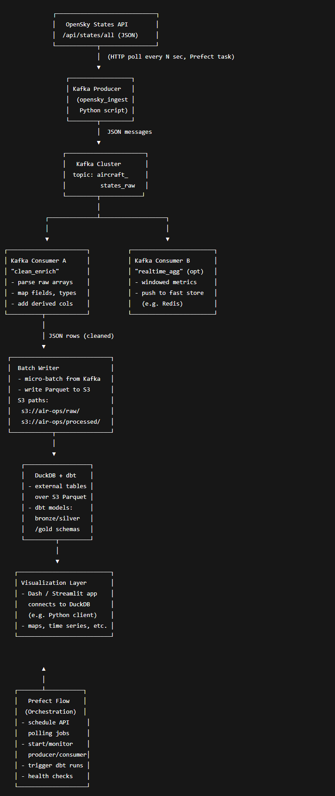

# DS_3022_DP3

## Overview

**API** -> https://openskynetwork.github.io/opensky-api/

**Aircraft Data Samples** -> https://opensky-network.org/datasets/#metadata/

**All Scientific Datasets** -> https://opensky-network.org/data/scientific#d5

**Data Tools** -> https://opensky-network.org/data/tools

### Broad Guide

poll every N seconds (listen to stream) → push records → Kafka → S3 → DuckDB → dbt.

Havent gotten to the super technical details yet but I think this is a good plan/starting point.

