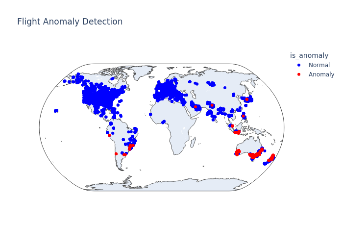

## Names:
Tyler Abele and Landon Burtle

## Data Source:
We utilize the **OpenSky Network API** to ingest live aircraft state vectors. This provides real-time telemetry including position (lat/lon), altitude (geometric and barometric), velocity, and aircraft identification (ICAO 24-bit address).

Additionally we use the Reference Data provided by the website to get information about both the airframes themseleves such as their model, operator, and aircraft type.

## Challenges:

1. **Streaming Data Volume & Windowing**: 
   - Handling the continuous influx of state vectors required a robust streaming architecture. We implemented **3-minute tumbling windows** to aggregate state changes and calculate deltas, rather than processing isolated points.
2. **Kafka Message Size Limits**: 
   - Aggregating thousands of flight states into single windowed messages exceeded standard 1MB Kafka limits. We had to reconfigure Redpanda and our producers to handle **large batch sizes (up to 100MB)** to ensure no data was dropped during high-traffic periods.
3. **Anomaly Definition**: 
   - Distinguishing between sensor noise and genuine anomalies is difficult. We moved from simple thresholding to **context-aware analysis**, comparing aircraft not just against global limits but against their specific aircraft type (peer comparison) and physical capabilities.

## Pipeline
Our analysis pipeline follows a **Modern Data Stack** approach:
1. **Ingest**: Python producer polls OpenSky API every 10s. This appraoch allows us to get high volumes of data that is quickly updated and processed. This allows us to utilize a sliding window approach to analyze changes withing relatively small timeframes. We utilize a kafka producer to acheive this
2. **Stream**: Redpanda (Kafka) consumer ingests the data and applies the sliding window set to a 3 minute window. This is insitrumental in our work for many reasons. The first important is that gives us multiple tries to locate an airraft withing a given window. Due to the limitations of the API and round radars, some aircraft may not be detected for a short period of time. Additionally, the windows allows us to do anomoly detection and analysis on a time scale. Since we will get about 18 different readings for an aircraft within a window, we can perform anomoly detection on a time scale..
3. **Store**: S3stores processed Parquet files aswell as the data we need in order to perfrom analysis on our aircraft states. Since some of these files can be quite large its good to keep them on the cloud and only pull them into the duckdb when needed. We created permission roles so that anyone can pull our data, but only we can write to it.
4. **Warehouse**: DuckDB performs high-performance analytical queries. We gather all of the parquet files and csv files and then do our analysis on them. The duckdb pipeline goes as follows: Loading, transforming, and then analysis. Additionally, we both do ananomoly detection over time and also analysis/plotting on the transformed data. 
5. **Analysis**: We perform analysis on the transformed data. We perform both time series analysis and spatial analysis. We also perform analysis on the transformed data to identify patterns and trends. We then create our images and save them to the images folder.

### Note:
We utilize a prefect workflow that, if given the right s3 persmission will run then entire pipeline automatically and produce new images with the updated data every 3 minutes. It is fully autonomous and will fun forever until stopped. However, if someone else is producing and consuming, anyone can run the workflow and still do the analysis and create the images.

## Analysis:
Commercial aviation generates an enormous volume of telemetry every second, yet the overwhelming majority of aircraft follow highly regulated and predictable flight envelopes. This makes air travel remarkably safe, but it also creates a valuable analytical opportunity: because normal behavior is so consistent, deviations become highly detectable. Our goal was to quantify these deviations in real time and understand both where and how often aircraft stray from typical operating conditions.

 Aircraft performance is heavily constrained by atmospheric physics: at higher altitudes, reduced air density requires higher true airspeeds to maintain lift, while at lower altitudes, drag increases and operational limits restrict maximum speed. When plotting geometric altitude against ground velocity, we observed a clearly defined performance envelope across aircraft categories (L1P, L2J, etc.). Quite note: for the category, the first letter is the type of aircraft (L for plane H for helicopter) and the second letter is the number of engines, and the last letter is the type of engine (P for piston, J for jet, etc.). As expected, jets cluster tightly around higher-altitude, higher-speed regimes, while turboprops and piston aircraft occupy lower, slower operational bands. This envelope served as a foundation for distinguishing statistically “normal” flight behavior from outliers.

To map where aircraft operate spatially, we produced a geospatial KDE heatmap, revealing global concentrations of active flights. Unsurprisingly, aircraft density is highest along established transcontinental corridors—North America, Europe, and East Asia—while anomalies tend to appear near highly trafficked hubs and transition points. This density model provided contextual grounding for interpreting outlier behavior geographically.

analyze air traffic patterns to find anaomolies -- right now I have the folders laid out in a way that we might want to look at military aircraft movement around military bases -- maybe looking for anomalies? -- we could do anything with the aircraft data really though.

# DS3022 Data Project 3

This data project is more open-ended than projects before it. You are asked to do something interesting with the data sources, tools, or approaches we have touched in the third block of this course. This could include fetching data from APIs and streaming sources, it could include Kafka or tools to fetch bulk data for processing.

## Project Ideas

Some ideas to use as inspiration but feel free to be creative:

- Use the **GitHub Events Archive** [https://www.gharchive.org/](https://www.gharchive.org/) and process a month's worth of activities. What types of events do you see? Make a visualization representing shifts or trends in this data, and explore unique dynamics across event types. Learn more about [GitHub Event Types](https://docs.github.com/en/rest/using-the-rest-api/github-event-types?apiVersion=2022-11-28).
- Use the near real-time [**GitHub Events API**](https://docs.github.com/en/rest/activity/events?apiVersion=2022-11-28) to look at recent events for a repository, user, organization. This is a **powerful** API that offers historical data up to 30 days in the past for any specific GitHub resource. It returns a maximum of 300 records. Be aware that this API is "near real-time" meaning events in this feed are delayed by at least 5 minutes and up to 6 hours, depending upon congestion and user traffic. Learn more about [GitHub Event Types](https://docs.github.com/en/rest/using-the-rest-api/github-event-types?apiVersion=2022-11-28). A full public API of all events in GitHub [is also available](https://docs.github.com/en/rest/activity/events?apiVersion=2022-11-28#list-public-events), be sure to return 100 pages per request. (Authenticated API requests are rate-limited at 5000 requests per hour, which means a maximum of 500,000 records per hour can be retrieved. This should be more than enough.) Note from the same API documentation that stargazers (users who have starred a specific repository) can be fetched as well. See [this page](https://docs.github.com/en/rest/activity/starring?apiVersion=2022-11-28) to read more.
- Use the **Authenticated GitHub API** and analyze the event or commit history for five of the following packages to compare/contrast. How many commits happened in the last month? In the last year? Can you plot commit/PR activity for the lifetime of one project? Does the commit history for the last 3 or 6 months represent significant changes in code? How many users are represented in the last 1000 commits? (Original committers, not those who approved pull requests.)
- Use the **Authenticated GitHub API** and analyze the event or commit history for five of the following packages to compare/contrast. How many commits happened in the last month? In the last year? Can you plot commit/PR activity for the lifetime of one project? Does the commit history for the last 3 or 6 months represent significant changes in code? How many users are represented in the last 1000 commits? (Original committers, not those who approved pull requests or bot accounts.)

    - `pandas`
    - `matplotlib`
    - `numpy`
    - `boto3`
    - `polars`
    - `seaborn`
    - `pytorch`
    - `scikit-learn`
    - `tensorflow`
    - `scipy`
    - `plotly`
    - `requests`
    - `beautiful-soup`
    - `nltk`

- Alternatively, you could refer to the [`hugovk` JSON list of the top 1000 packages](https://raw.githubusercontent.com/hugovk/top-pypi-packages/main/top-pypi-packages.json) from PyPi.
- Write a **GUI application** that takes the name of a GitHub repository as an input which generates a series of commit/contributor analyses and plots. You could represent the density of commits (adding code, removing code, etc.) Think of it as an activity dashboard generated for any repo name it is given.
- Continue to work with the **Bluesky Firehose**. Gather 100k posts or comments into Kafka and perform a simple sentiment analysis on that text. Identify the top 20 topics or tags for that time period. (Note: you could learn how to code/run this yourself using NLTK, or articles like this from Hugging Face. Or, this might be something LLMs are quite good at. Can you submit your request to the ChatGPT or Claude API via code?)
- Continue to work with the **Wikipedia Event Stream**. What interesting trends do you find when you gather 50k messages?
- Work with data from **other open APIs and data streams**. There are many to choose from [here](https://github.com/bytewax/awesome-public-real-time-datasets) as well as more listed in Module 0.

## Good Sources / Worthy Projects

What does "something interesting" look like? Here are some criteria to use when deciding on a good data source and deliverables:

- **Scale & Complexity**
    - Processing of substantial data volumes (50K+ records minimum, ideally 100K-1M+)
    - Multiple data transformation steps beyond simple filtering
    - Handling of real-world messiness: missing values, inconsistent formats, rate limits, API pagination
    - Evidence that the data presented genuine engineering challenges, not just a single API call
- **Technical Depth & Tool Integration**
    - Use of at least 2-3 modern data engineering tools from the course (streaming platforms, workflow orchestrators, databases, containerization)
    - Thoughtful tool selection with clear rationale for why each was chosen
    - Evidence of proper data pipeline architecture (ingestion → processing → storage → analysis)
    - Code that demonstrates understanding beyond copy-pasting tutorials
- **Insight Generation Beyond Description**
    - Analysis that reveals non-obvious patterns or trends
    - Goes beyond "here's what the data looks like" to "here's what the data means"
    - Comparative analysis, temporal trends, anomaly detection, or predictive elements
    - Clear articulation of at least one surprising or counterintuitive finding
    - Visualizations that illuminate patterns humans couldn't spot in raw data
- **Real-World Relevance & Domain Context**
    - Connection to actual problems or questions people care about
    - Domain knowledge application (understanding what the data represents, not just treating it as abstract numbers)
    - Consideration of data quality, bias, or limitations in interpretation
    - Potential implications or applications of the findings
    - Context that shows why this analysis matters to developers, businesses, or society
- **Reproducibility & Documentation**
    - Clear setup instructions that enable others to run the pipeline
    - Well-organized repository structure with logical separation of concerns
    - Environment specifications (requirements.txt, docker-compose.yml, etc.)
    - Meaningful code comments explaining why decisions were made, not just what the code does
    - Discussion of challenges encountered and how they were overcome
    - Honest acknowledgment of limitations or trade-offs
- Draws upon skills and underastanding from other courses.
- Each team member should plan on contributing an estimated 6-10 hours total for this project.

**Weak project**: "We collected 10,000 GitHub stars and made a bar chart of their programming languages"

**Strong project**: "We ingested the full history of commits for 5 data science packages, used DuckDB to identify repos with emerging velocity changes in commits, discovered that repos emphasizing 'performance' gained both commits and stars 3x faster in machine learning while 'simplicity' messaging dominated in plotting and viz tools, then built a Prefect workflow that could monitor this in real-time for trend detection for any specific repo."

You may work with up to ONE (1) partner on this project. Any student in either DS3022 section can be your partner. You may also choose to work alone.

## Other notes and comments:

- Teams should work independently (no cross-team collaboration).
- Both team members should contribute code to the same repository. You may add a teammate to a repository by going to Settings -> Collaborators & Teams.
- Your work should be in python, should be contained in a separate repository (not your fork of the DP3 repository, only use that for your findings) and demonstrate all the usual normal expectations - comments, error handling, and logging.
- You may use your own laptop or Amazon EC2 instance for computational resources. Be mindful of costs!
- ADULT CONTENT - Be aware that analysis on social media data comes with the risk of exposure to content for mature audiences. This can be ignored or filtered out if desired.
- Your solution does not need to automate the entire process end-to-end (data collection, analysis, plots, etc.) in a single script, but should require no manual edits, cleaning, copy+paste, or other manual steps (beyond running a series of scripts in a specific order) in order to reproduce your work.

## Submission

Your group/team will write up a one page summary of your work, written in markdown, which should include:

1. The names of your team members.
2. What data source did you work with?
3. What challenges did this data choice present in data gathering, processing and analysis, and how did you work through them? What methods and tools did you use to work with this data?
4. Offer a brief analysis of the data with your findings. Keep it brief, clear, and meaningful. 
5. Include at least one compelling plot or visualization of your work.
6. Link to your project GitHub repository.

To submit your team's summary, fork this repository, then copy the "sample" directory in your fork give it a unique name. Next, edit the README.md file within that directory and include/embed your plots in that directory and in the README file as needed. Finally, submit a pull request for your changes to be incorporated back into the upstream source. Only one pull request per team is necessary.

**Submissions are due by 11:59pm on Monday, November 24, 2025.**

## Grading Rubric

A rough breakdown of the 50 points available in this project:

- Choice of data source (10 points)
- Effort and technical agility in data consumption, transformation, and loading (15 points)
- Quality of analysis and unique approaches (10 points)
- Results, plots, meaningful insights (10 points)
- Overall cohesiveness, originality, and focus of the project (5 points)

## Judging & Prizes 🏆
After completion students and TAs will vote for their top 3 projects and there will be a prize for the top voted project in each section. (And I mean a _real_ prize.)
Building on these baselines, we implemented a multidimensional anomaly-detection system using an Isolation Forest. Rather than relying on simplistic thresholds, this model detects irregular patterns based on how quickly a sample can be isolated from the rest of the dataset. Because normal aircraft follow predictable spatial, kinematic, and vertical profiles, deviations in variables such as latitude, longitude, barometric altitude, velocity, and vertical rate often produce significantly shorter isolation paths, marking the flight as anomalous. This method is particularly effective for aviation telemetry because it naturally captures complex interactions—high climb rates at unusually low altitudes, lateral deviations inconsistent with standard airways, or velocity profiles that violate typical aircraft-category boundaries.

When applied to real flight windows, the model successfully identified a small but meaningful subset of flights flagged as anomalies. Some of these deviations correspond to benign causes—weather rerouting, holding patterns, or general-aviation variability—while others highlight operationally interesting behavior such as steep descents, abnormal climb rates, or flight paths deviating from established commercial routes. Visualizing these anomalies on a global map further illustrated their distribution: normal flights cluster densely along expected corridors, while anomalies appear intermittently across Europe, Southeast Asia, Oceania, and portions of South America.

Overall, our analysis demonstrates that even within a globally consistent aviation ecosystem, detectable irregularities occur constantly, and machine-learning methods provide a powerful framework for quantifying these deviations at scale. By combining aerodynamic performance modeling, spatial density analysis, and unsupervised anomaly detection, we can effectively identify outliers in a system where normal behavior is both abundant and well understood.

## Github 

[Repo Link](https://github.com/Tyler-Abele/DS_3022_DP3)

## Plots

